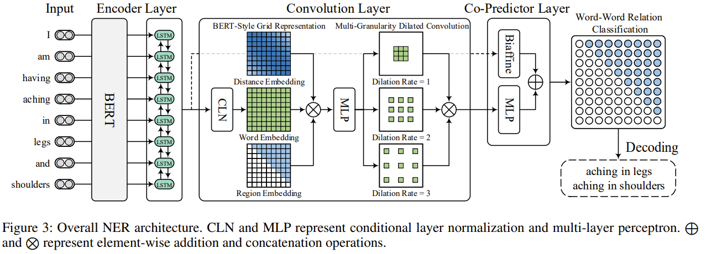

 # Unified Named Entity Recognition as Word-Word Relation Classification

Source code for AAAI 2022 paper: [Unified Named Entity Recognition as Word-Word Relation Classification](https://arxiv.org/pdf/2112.10070.pdf)

### Label Scheme
<p align="center">
  
</p>

### Architecture
<p align="center">
  
</p>

## 1. Environments

```
- python (3.8.12)
- cuda (11.4)
```

## 2. Dependencies

```
- numpy (1.21.4)
- torch (1.10.0)
- gensim (4.1.2)
- transformers (4.13.0)
- pandas (1.3.4)
- scikit-learn (1.0.1)
- prettytable (2.4.0)
```


## 3. Training

```bash
>> python server.py or gunicorn -c gunicorn.py server:app
```


